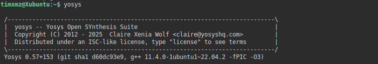

# RISC-V Reference SoC Tapeout Program VSD

## Tools Installation

#### Instruction for installation of the tools:

### **System Check**
- 6 GB RAM, 50 GB HDD
- Ubuntu 20.04+
- 4 vCPU

### **Tool Check**

#### <ins>**Yosys**</ins>
```bash
$ sudo apt-get update
$ git clone https://github.com/YosysHQ/yosys.git
$ cd yosys
$ sudo apt install make    #If make is not installed
$ sudo apt-get install build-essential clang bison flex \
    libreadline-dev gawk tcl-dev libffi-dev git \
    graphviz xdot pkg-config python3 libboost-system-dev \
    libboost-python-dev libboost-filesystem-dev zlib1g-dev
$ make config-gcc
#Yosys includes required libraries like abc as Git submodules. If these submodules are not initialized or updated correctly, make can encounter errors.
#So we run the following command
$ git submodule update --init --recursive
$ make 
$ sudo make install
```


#### <ins>**Iverilog**</ins>
```bash
$ sudo apt-get update
$ sudo apt-get install iverilog
```


#### <ins>**gtkwave**</ins>
```bash
$ sudo apt-get update
$ sudo apt install gtkwave
```

